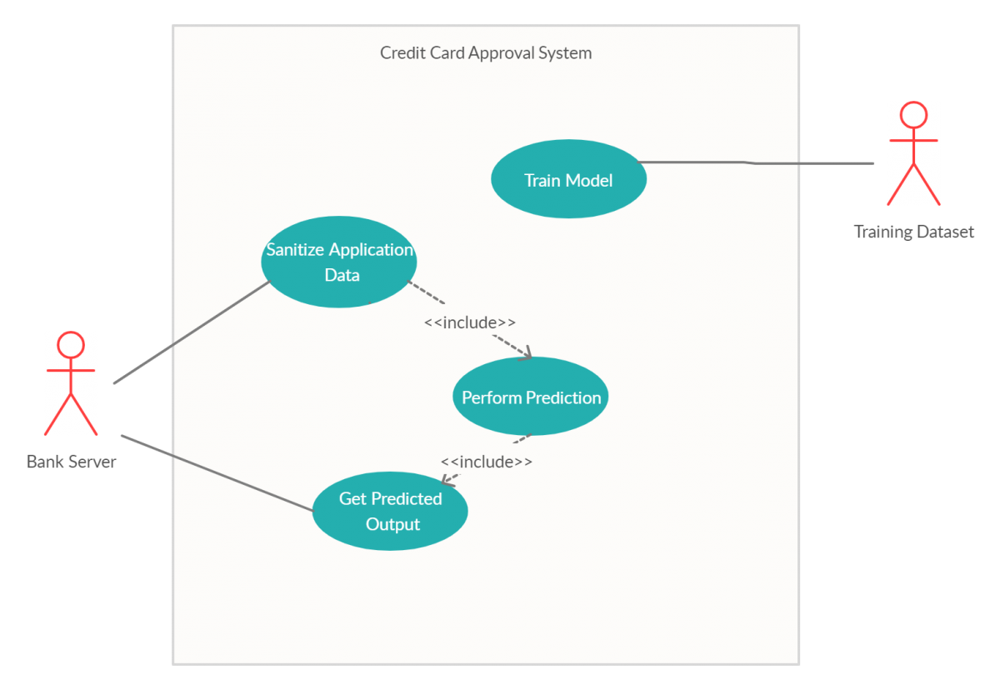
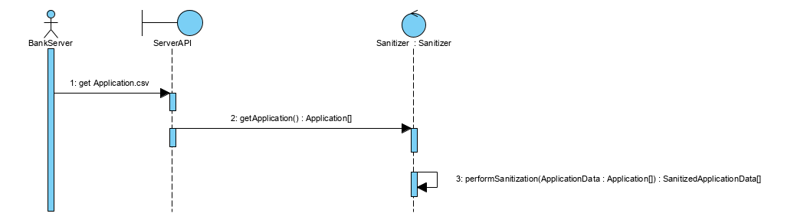
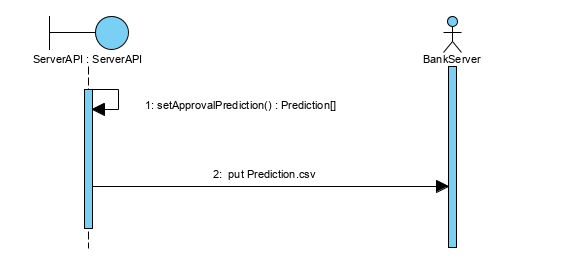
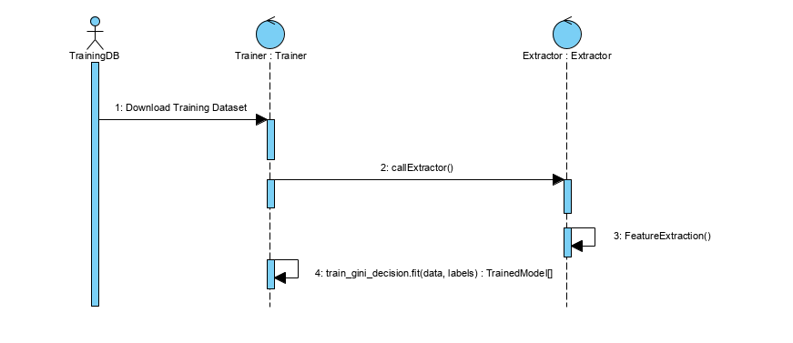
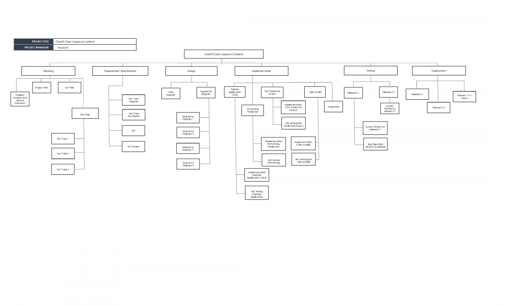

# Team Maven : Credit Card Approval System
Design Lab Project 
# Problem Statement
Small businesses must seek credit approval to obtain funds from lenders, investors, and vendors, and also grant credit approval to their customers. Banking industries receive so many applications for credit card request. Going through each request manually can be very time consuming, also prone to human errors. 
# Solution Statement
**I** - Building a probabilistic statistical model that looks into historical data to find patterns in what parameters lie in decision making behind the approval of a credit model.
**II** - Deploying a trained model.The bank server makes a FTP request to Maven , sending it their list of applications for the day. Maven's AI cron job does the predictions and sends it back to the bank.
**III** - To ensure model robustness, model is refreshed every 5 days by developers working on Maven. They employ public/privatised data and a myriad of boosted trees and other advanced algorithms to make sure misclassification can be avoided as much as possible during inference phase. 

# Initial Setup
- `conda create -n mavenlab python=3.6`
- `conda activate mavenlab`
- `sh setup.sh`

# Quick Run
- `cd src/`
- `chmod +x run.sh`
- `sh run.sh`
# Tests
- `cd tests/`
- `chmod +x runtests.sh`
- `sh runtests.sh`

# Statistical Training Ground
Preconfigured Notebook can be played [here.](https://colab.research.google.com/drive/1bk8envVjTJP6UuSj83m3EVf3DWUkr-xt)

# Use Case Diagram

# Class Diagram

# Sequence Diagrams

# WBS

